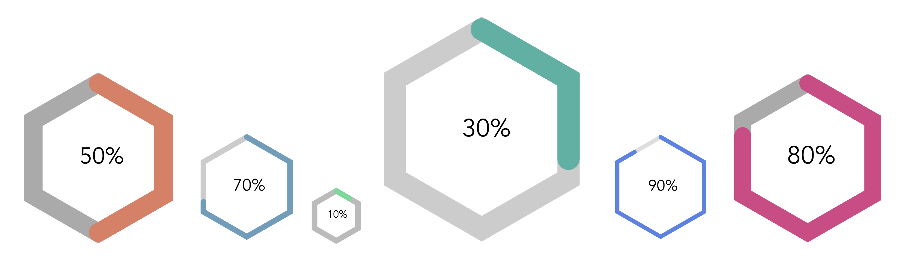

# vue-hexagon

 

A Hexagon component for vue.js applications


-----

### How to use

#### Installation
- npm install vue-hexagon

- In main.js add the below two lines of code

#### Usage
````
import Vue from 'vue';
import VueHexagon from 'vue-hexagon';

Vue.use(VueHexagon);
````

- In any component where you would like to use vue hexagon, you can create an options object with the below fields

````
const options = {
  width: 200,
  height: 200,
  primaryColor: '#45ad9a',
  secondaryColor: '#aaa',
  labelColor: '#000',
  label: '50%',
  value: 50,
  className: 'vue-hexagon-custom-class',
  thickness: 90,
  fontSize: 120,
};

````
- Then in the html code you can use as mentioned below
````
<VueHexagon :options=options>
````

- All the options are optional. If you don't pass any specific options, then the default options are as below

````
{
  width: 200,
  height: 200,
  primaryColor: '#45ad9a',
  secondaryColor: '#aaa',
  labelColor: '#000',
  label: '50%',
  value: 50,
  className: 'vue-hexagon-custom-class',
  thickness: 90,
  fontSize: 120,
}
````


https://www.telerik.com/blogs/vuejs-how-to-build-your-first-package-publish-it-on-npm
